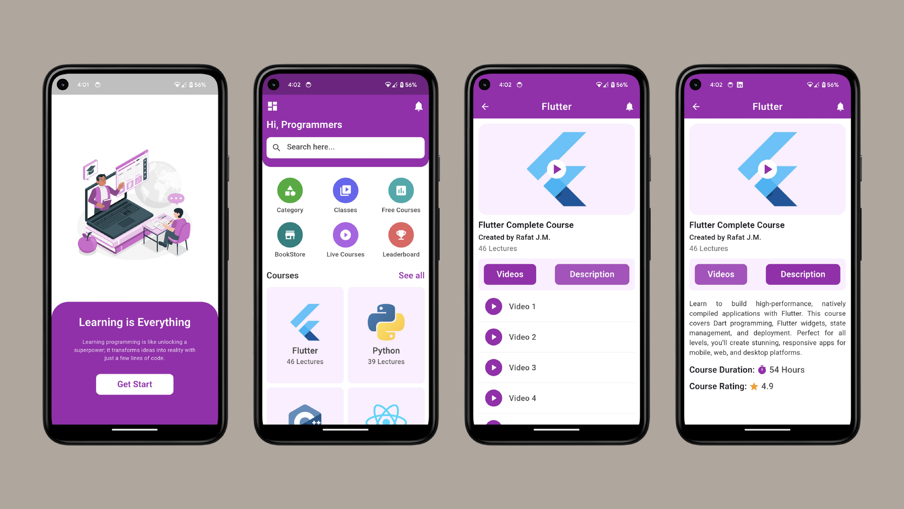

# Edu-Tech App UI

Edu-Tech is a sleek and modern educational technology app designed to provide an intuitive and engaging user interface. Built using Flutter, this app showcases the potential for creating a rich user experience with seamless performance across multiple platforms.



## Getting Started

### Prerequisites

Ensure you have the following installed:

- [Flutter](https://flutter.dev/docs/get-started/install)
- [Dart](https://dart.dev/get-dart)

### Installation

1. Clone the repository:
    ```bash
    git clone https://github.com/DevNadimm/Edu-Tech.git
    ```
2. Navigate to the project directory:
    ```bash
    cd Edu-Tech
    ```
3. Install the dependencies:
    ```bash
    flutter pub get
    ```
4. Run the app:
    ```bash
    flutter run
    ```

## Usage

Once the app is running, you can explore the different sections of the Edu-Tech app, including the home page, course listings, and course view.

## Contact

If you have any questions or suggestions, feel free to reach out at nadimchowdhury87@gmail.com.

---

Happy Coding!
